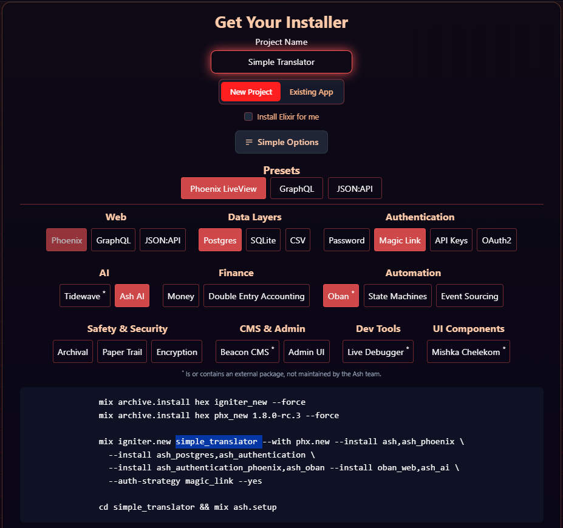

%{
 slug: "background-ai-translator-in-ash",
 title: "Background AI Translator in Ash",
 description: "Tutorial on how to trigger a background job (AshOban) to translate (LangChain) database fields and store them (AshTrans)",
 published: true,
 tags: ["Elixir", "Ash", "AshOban", "AshTrans", "LangChain"]
}

---
## Introduction

In this simple tutorial, I'll show you how to translate your database fields in the background after an update.

## Setup Project

```
➜  ~ asdf current
elixir          1.19.0-rc.0-otp-27 /home/ken/.tool-versions
erlang          27.2            /home/ken/.tool-versions
```

First, let's initialize a project using [Ash HQ](https://ash-hq.org/#get-started) form.

I named the project `SimpleTranslator`. I don't need to install Elixir and I added Ash AI (which comes with LangChain) and Oban. I removed Admin UI and Live Debugger because it's not relevant.



The commands are given:
```
mix archive.install hex igniter_new --force
mix archive.install hex phx_new 1.8.0-rc.3 --force

mix igniter.new simple_translator --with phx.new --install ash,ash_phoenix \
 --install ash_postgres,ash_authentication \
 --install ash_authentication_phoenix,ash_oban --install oban_web,ash_ai \
 --auth-strategy magic_link --yes

cd simpletranslator && mix ash.setup
```
Let's run that and if all goes well we have set up a new project!

### Adding [AshTrans](https://github.com/TimisRobert/ash_trans)

> AshTrans - An Ash extension that provides translations to a resource.

You can check out [Get Started with AshTrans](https://github.com/TimisRobert/ash_trans/blob/main/documentation/tutorials/get-started-with-ash-trans.md) and try it out but for now just add the dependency `{:ash_trans, "~> 0.1.4"}` to the `mix.exs` file and for formatter, in `.formatter.exs` under `import_deps` add `:ash_trans`.

Don't forget to `mix deps.get`!


**Extra step**

To make it more clear let's add a file `.iex.exs` to the root of the project and alias Repo and User:

```elixir
alias SimpleTranslator.Repo
alias SimpleTranslator.Accounts.User
```

## Setup Data

First, export your OpenAI API key and Org ID:

```
export OPENAI_ORG_ID="org-your-org-id"
export OPENAI_API_KEY="sk-your-api-key"
```

Then let's add an attribute `:about_me` to the `User` resource in the `attributes` section:

```elixir
    attribute :about_me, :string do
      allow_nil? true
      public? true
    end
```
Run `mix ash.codegen add_user_about_me` and `mix ash.migrate`

Let's start the server `iex -S mix phx.server` and go to `localhost:4000/register`. Enter an email. 

Go to `localhost:4000/dev/mailbox` and sign in using the link. This will trigger the creation of a user record.

In our shell running `Repo.all User` gives:

```elixir
iex(2)> Repo.all User
[debug] QUERY OK source="users" db=0.7ms idle=1477.7ms
SELECT u0."id", u0."email", u0."about_me" FROM "users" AS u0 []
↳ :elixir.eval_external_handler/3, at: src/elixir.erl:355
[
 %SimpleTranslator.Accounts.User{
    id: "a20e272a-f9d0-435e-897b-41a17ffbee60",
    email: #Ash.CiString<"kenneth.kostresevic@gmail.com">,
    about_me: nil,
    __meta__: #Ecto.Schema.Metadata<:loaded, "users">
 }
]
```

Great! One more thing: in `actions` section to `defaults` let's add `update: :*`. We will use this later.

## Configure AshTrans

To our `User` resource we'll expand the `extensions` with `AshTrans.Resource` and add our `translations` section for translating to Italian and French:

```elixir
  translations do
    public? true
    fields [:about_me]
    locales [:it, :fr]
  end
```

We also need to run `mix ash.codegen add_user_translations` and `mix ash.migrate` to add the translations map field to user.

## Implement translate action

Let's implement a custom action that will be triggered by the Oban job, under `actions` section we'll have the:

```elixir
    action :translate do
      run fn input, _context ->

      end
    end
```

For a custom action, the only thing we can expect from the Oban call is the resource ID in input.
This means we can fetch the user with: 

```elixir
user = Ash.get!(__MODULE__, input.params["primary_key"]["id"])
```

Since we configured our AshTrans we can get the necessary information we need for our translation:

```elixir
fields = AshTrans.Resource.Info.translations_fields!(__MODULE__)
locales = AshTrans.Resource.Info.translations_locales!(__MODULE__) 
```

We have all we need for a prompt! Here's the prompt I made that worked:

```elixir
"""
Here's a jason map: #{inspect(user_fields)}.
Translate values and for these locales: #{inspect(locales)}.
Return only a jason map with locales for keys and translated jason map as values, nothing else.
Do not wrap the response in a json code block, response needs to start with { and end with }.
"""
```

Where `user_fields` is `Map.take(user, fields)`.
As you can see, I made sure the response is just a json struct.

Alright, now we initialize a model:

```elixir
input = LangChain.ChatModels.ChatOpenAI.new!(%{model: "gpt-4o-mini"})
```

& make the call:
```elixir
{:ok, [message]} = LangChain.ChatModels.ChatOpenAI.call(input, prompt)
```

Then we decode the message content which should have our translations in the form of a jason and then we can update the user with translations.

Here's the whole action:
```elixir
    action :translate do
      run fn input, _context ->
        opts = [authorize?: false]
        user = Ash.get!(__MODULE__, input.params["primary_key"]["id"], opts)
        fields = AshTrans.Resource.Info.translations_fields!(__MODULE__)
        user_fields = Map.take(user, fields)
        locales = AshTrans.Resource.Info.translations_locales!(__MODULE__)

        prompt =           
          """
 Here's a jason map: #{inspect(user_fields)}.
 Translate values and for these locales: #{inspect(locales)}.
 Return only a jason map with locales for keys and translated jason map as values, nothing else.
 Do not wrap the response in a json code block, response needs to start with { and end with }.
 """

        input = LangChain.ChatModels.ChatOpenAI.new!(%{model: "gpt-4o-mini"}) 
 {:ok, [message]} = LangChain.ChatModels.ChatOpenAI.call(input, prompt)  
        params = %{translations: Jason.decode!(message.content, keys: :atoms)} 
        Ash.update(Ash.Changeset.for_update(user, :update, params, opts))
      end
    end
```

Notice I also added `opts = [authorize?: false]` to skip the authorization policy.

## Trigger a background job

Since this could be a potentially long external API call let's trigger an oban job that will do the translations in the background.

First, we expand `extensions` by adding `AshOban`. Then we can define our trigger:

```elixir
  oban do
    triggers do
      trigger :translate_trigger do
        action :translate
        worker_read_action :read
        scheduler_cron false
        worker_module_name AshTransAiTest.Accounts.User.AshOban.Worker.TranslateTrigger
      end
    end
  end
```

We also need to update the `queues` in `config.exs` for Oban configuration by adding to it `user_translate_trigger: 10`.

Since we have some initial auth policies we need to add a bypass for AshOban in `policies` section:
```elixir
    bypass AshOban.Checks.AshObanInteraction do
      authorize_if always()
    end
```

Then we implement an update about me action:

```elixir
    update :update_about_me do
      accept [:about_me]
      change run_oban_trigger(:translate_trigger)
    end
```

& define it's interface:

```elixir
  code_interface do
    define :update_about_me, action: :update_about_me
  end
```

That should do it! Let's try to run it.

## Run

`iex -S mix`:
 - Get the user:
```elixir
iex(1)> user = Repo.one User
[debug] QUERY OK source="users" db=5.5ms queue=0.3ms idle=1039.4ms
SELECT u0."translations", u0."id", u0."email", u0."about_me" FROM "users" AS u0 []
↳ :elixir.eval_external_handler/3, at: src/elixir.erl:355
[
 %SimpleTranslator.Accounts.User{
    translations: nil,
    id: "a20e272a-f9d0-435e-897b-41a17ffbee60",
    email: #Ash.CiString<"kenneth.kostresevic@gmail.com">,
    about_me: nil,
    __meta__: #Ecto.Schema.Metadata<:loaded, "users">
 }
]
```

 - Call the action:
```elixir
iex(38)> User.update_about_me user, %{about_me: "I love programming in Elixir."}, authorize?: false
[debug] QUERY OK db=0.1ms idle=1364.8ms
begin []
↳ Ash.Actions.Update.Bulk.run/6, at: lib/ash/actions/update/bulk.ex:276
[debug] QUERY OK source="users" db=0.3ms
UPDATE "users" AS u0 SET "about_me" = $1 WHERE (u0."id"::uuid = $2::uuid) RETURNING u0."translations", u0."id", u0."email", u0."about_me" ["I love programming in Elixir.", "a20e272a-f9d0-435e-897b-41a17ffbee60"]
↳ anonymous fn/3 in Ecto.Adapters.SQL.checkout_or_transaction/4, at: lib/ecto/adapters/sql.ex:1458
[debug] QUERY OK db=4.8ms
commit []
↳ Ash.Actions.Update.Bulk.run/6, at: lib/ash/actions/update/bulk.ex:276
{:ok,
 %SimpleTranslator.Accounts.User{
   translations: nil,
   id: "a20e272a-f9d0-435e-897b-41a17ffbee60",
   email: #Ash.CiString<"kenneth.kostresevic@gmail.com">,
   about_me: "I love programming in Elixir.",
   __meta__: #Ecto.Schema.Metadata<:loaded, "users">
 }}
[debug] QUERY OK source="users" db=0.4ms idle=1383.6ms
SELECT u0."id", u0."email", u0."translations", u0."about_me" FROM "users" AS u0 WHERE (u0."id"::uuid = $1::uuid) LIMIT $2 ["a20e272a-f9d0-435e-897b-41a17ffbee60", 2]
↳ anonymous fn/3 in AshPostgres.DataLayer.run_query/2, at: lib/data_layer.ex:788
[debug] QUERY OK source="users" db=2.2ms idle=1162.8ms
UPDATE "users" AS u0 SET "translations" = $1::jsonb WHERE (u0."id"::uuid = $2::uuid) RETURNING u0."id", u0."email", u0."translations", u0."about_me" [%SimpleTranslator.Accounts.User.Translations{it: %SimpleTranslator.Accounts.User.Translations.Fields{about_me: "Amo programmare in Elixir.", __meta__: #Ecto.Schema.Metadata<:built, "">}, fr: %SimpleTranslator.Accounts.User.Translations.Fields{about_me: "J'adore programmer en Elixir.", __meta__: #Ecto.Schema.Metadata<:built, "">}, __meta__: #Ecto.Schema.Metadata<:built, "">}, "a20e272a-f9d0-435e-897b-41a17ffbee60"]
↳ AshPostgres.DataLayer.update_query/4, at: lib/data_layer.ex:1534
iex(39)> 
```

 - Action returns `nil` for translations but we can see something happens post action. And fetching the user again:

 ```elixir
iex(39)> user = Repo.one User
[debug] QUERY OK source="users" db=0.6ms idle=428.3ms
SELECT u0."translations", u0."id", u0."email", u0."about_me" FROM "users" AS u0 []
↳ :elixir.eval_external_handler/3, at: src/elixir.erl:355
%SimpleTranslator.Accounts.User{
  translations: %SimpleTranslator.Accounts.User.Translations{
    it: %SimpleTranslator.Accounts.User.Translations.Fields{
      about_me: "Amo programmare in Elixir.",
      __meta__: #Ecto.Schema.Metadata<:built, "">
 },
    fr: %SimpleTranslator.Accounts.User.Translations.Fields{
      about_me: "J'adore programmer en Elixir.",
      __meta__: #Ecto.Schema.Metadata<:built, "">
 },
    __meta__: #Ecto.Schema.Metadata<:built, "">
 },
  id: "a20e272a-f9d0-435e-897b-41a17ffbee60",
  email: #Ash.CiString<"kenneth.kostresevic@gmail.com">,
  about_me: "I love programming in Elixir.",
  __meta__: #Ecto.Schema.Metadata<:loaded, "users">
}
 ```

## Conclusion

I do love programming in Elixir. This is the first tutorial/article I made. I'm not convinced of its usefulness but I liked the idea of being able to translate database data automatically and discreetly and I pursued it. Packaging that into a tutorial felt right.

I'm sure the prompt could be improved and I haven't tried, but I think this could also work with `AshAi` prompt run directly, but since that's more of a black box I preferred this approach.

Some additional ideas regarding this would be to integrate it with `Cldr` locales.
Also, I'm thinking, with `MDEx` and `AshAdmin` it could be something more interesting perhaps. But for now, this proof of concept will do. Hope you found something useful in this! Here's the [link to the repo](https://github.com/ken-kost/simple_translator).